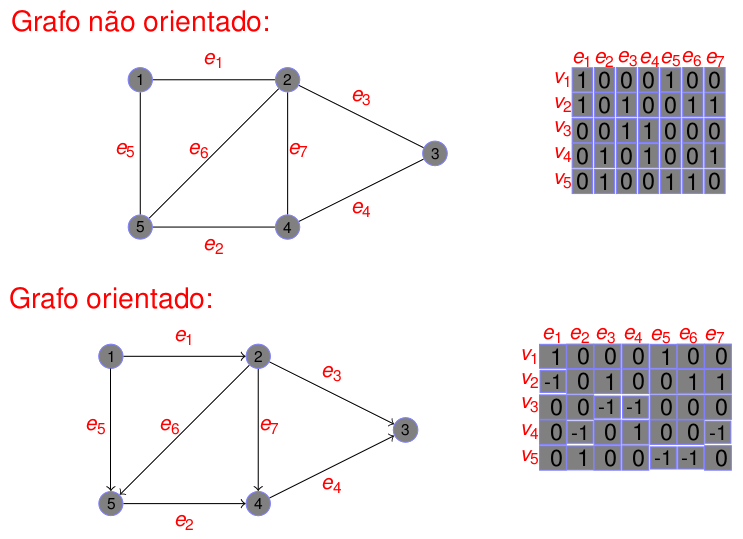
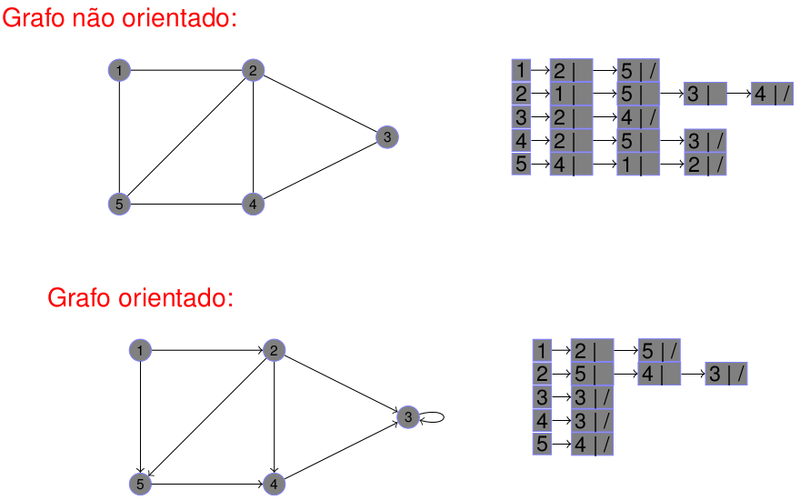

# Grafos: Lista de Adjacência

<div style="display: inline-block;">
 
 
 
<a href="https://github.com/mpiress/midpy/issues">


</a> 
</div>

<p> </p>
<p> </p>

<p align="justify">
Ao se pensar em definir uma estrutura para a representação de grafos é preciso inicialmente considerar sua <b>densidade</b>, ou seja, sua relação entre vértices (V) e arestas (E). 
</p>

>
> Se um grafo apresenta muitas conexões ou arestas dentre os múltiplos vértices existentes esse é classificado como grafo **denso**. Segundo *Cormen et. al.* [1], um grafo é dito **denso**, se somente se, o número de arestas $|E|$ é próximo de $|V|^2$.
>

>
> Um grafo considerado não **denso** é nomeado como grafo **esparso**. Nesse contexto, o conjunto $|E|$ de arestas se apresenta como sendo muito menor que $|V|^2$.
> 

<p align="justify">
Considerando as terminologias acima citadas, é possível, pela identificação da <i>densidade</i> do grafo, definir a forma mais adequada de representação da estrutura. Objetiva-se com isso maximizar o desempenho de algoritmos aplicáveis,bem como, reduzir o tempo de execução. 
</p>

<p align="justify">
Em literatura, os três modelos clássicos para representação são: matriz de (i) incidência e (ii) adjacência e (iii) lista de adjacência. 
</p>

>
> **Matriz de incidência**: Seja $G = (V, E)$ um grafo **denso**. Suponha que $< v_1, v_2, \dots, v_n >$ sejam os vértices desse grafo e $< e_1, e_2, \dots, e_m >$ as arestas de $G$. A matriz de incidência com relação a ordem de $|V|$ e $|E|$ é a matriz $nxm$, tal que, $M = [m_{ij}]$ com:
> <p align="center">
>   <br/>
> </p>

A Fig 1 detalha um pequeno exemplo de representação utilizando a estrutura matriz de incidênia para descrevere um grafo simples. 

<p align="center">
  <br/>
  <caption> <b>Fig 1.</b> Pequeno exemplo de representação por matriz de incidência para grafos orientados e não orientados.</caption>
</p> 

>
> **Matriz de adjacência**: Estrutura criada também para lidar com grafos **densos**. Contudo, ao contrário do modelo por incidência, nessa matriz as linas e colunas são utilizadas para representar a relação entre dois vértices { $u,v$ } quaisquer.Logo, a matriz de adjacência $A$ ou $A_G$ de $G = (V,E)$ é a matriz *zero-um* $nxn$ com $(i,j)$ em 1 para representar a relação de adjacência de $v_i$ e $v_j$ e 0 caso contrário. Então, dados $A=[a_{ij}]$ logo:
> <p align="center">
>   <br/>
> </p>

A Fig 2 detalha um pequeno exemplo de representação utilizando a estrutura matriz de adjacência para descrevere um grafo simples. 

<p align="center">
  <br/>
  <caption> <b>Fig 2.</b> Pequeno exemplo de representação por matriz de adjacência para grafos orientados e não orientados.</caption>
</p> 

>
> **Lista de adjacência**: A lista de adjacência é a estrutura mais utilizada para representação de grafos, pirncipalmente para casos de grafos **esparsos**. A representação de uma lista $Adj$ de adjacência de um grafo $G=(V,E)$ consiste em um arrando de $|V|$ listas, uma para cada vértice $u$ existente em $|V|$. Logo, para cada $u \in V$, a lista de adjacência $Adj[u]$ comtém todos os vértices $v$ que definem uma aresta { $u,v$ } $\in E$.
>

A representação por lista de adjacência é uma boa opção quando o grafo é *esparso* e **não há** arestas múltiplas. Em geral, os vértices de cada lista de adjacência estão armazenados em **ordem arbitrária**. A Fig 3 detalha um pequeno exemplo de representação utilizando a estrutura lista de adjacência para descrevere um grafo simples.

<p align="center">
  <br/>
  <caption> <b>Fig 3.</b> Pequeno exemplo de representação por lista de adjacência para grafos orientados e não orientados.</caption>
</p> 


```c $(document).on('change','#selectproductform-type',function(){if($(this).val() == TYPE_PRODUCT)$('.product-select2-widget').show();else$('.product-select2-widget').hide();});

> struct TipoVertex{
>   int value;
>   Vertex prox;
> };
>
>
> struct graph{
>   int V;
>   int E;
>   Vertex *adj; //LISTA DE ADJ
> };

```

# Compilação e Execução

A estrutura de grafo disponibilizada possui um arquivo Makefile que realiza todo o procedimento de compilação e execução. Para tanto, temos as seguintes diretrizes de execução:


| Comando                |  Função                                                                                           |                     
| -----------------------| ------------------------------------------------------------------------------------------------- |
|  `make clean`          | Apaga a última compilação realizada contida na pasta build                                        |
|  `make`                | Executa a compilação do programa utilizando o gcc, e o resultado vai para a pasta build           |
|  `make run`            | Executa o programa da pasta build após a realização da compilação                                 |

# Referências

<p align="justify">
[1] Thomas H. Cormen, Charles E. Leiserson, Ronald L. Rivest, Clifford Stein. Algoritmos:  Teoria e Prática. 3a edição. Elsevier, 2012. ISBN 9788535236996
</p>

# Contatos

<div style="display: inline-block;">
<a href="https://t.me/michelpires369">
 
</a>

<a href="https://www.linkedin.com/in/michelpiressilva/">

</a>

</div>

<p> </p>


<a style="color:black" href="mailto:michel@cefetmg.br?subject=[GitHub]%20Source%20Dynamic%20Lists">
✉️ <i>michel@cefetmg.br</i>
</a>

